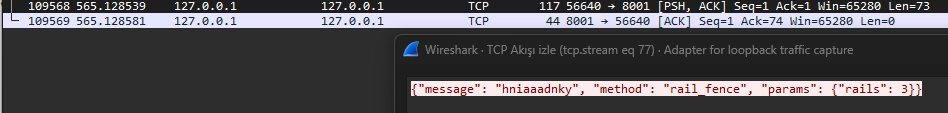

# Şifreli İstemci-Sunucu Uygulaması

Bu Python uygulaması, Tkinter GUI kullanarak modern bir arayüz sunar ve çeşitli şifreleme yöntemleri içerir.

## Özellikler

- **GUI İstemci**: Tkinter ile modern arayüz
- **Sunucu**: Socket tabanlı çoklu istemci desteği
- **Şifreleme Yöntemleri**:
  - Caesar Şifreleme
  - Vigenere Şifreleme
  - Substitution Şifreleme
  - Rail Fence Şifreleme
  - Affine Şifreleme

## Kurulum

1. Python 3.7+ gereklidir
2. Herhangi bir ek paket kurulumu gerekmez (sadece standart kütüphane kullanılır)

## Kullanım

### Sunucuyu Başlatma

```bash
cd python_client_server
python run_server.py
```

### İstemciyi Başlatma

```bash
cd python_client_server
python run_client.py
```

## Şifreleme Yöntemleri

### 1. Caesar Şifreleme
- **Parametre**: Kaydırma miktarı (shift)
- **Örnek**: Shift=3 için "ABC" → "DEF"

### 2. Vigenere Şifreleme
- **Parametre**: Anahtar kelime
- **Örnek**: Anahtar="KEY" ile "HELLO" → "RIJVS"

### 3. Substitution Şifreleme
- **Parametre**: 26 harflik alfabe karışımı
- **Örnek**: "QWERTYUIOPASDFGHJKLZXCVBNM" ile A→Q, B→W, vb.

### 4. Rail Fence Şifreleme
- **Parametre**: Ray sayısı
- **Örnek**: 3 ray ile "HELLO" → "HOEL L"

### 5. Affine Şifreleme
- **Parametreler**: 
  - A: 1-25 arası, 26 ile aralarında asal
  - B: 0-25 arası
- **Formül**: E(x) = (ax + b) mod 26

## Proje Yapısı

```
python_client_server/
├── client/
│   ├── __init__.py
│   └── client.py          # GUI istemci
├── server/
│   ├── __init__.py
│   └── server.py          # Sunucu
├── encryption/
│   ├── __init__.py
│   └── ciphers.py         # Şifreleme yöntemleri
├── requirements.txt
└── README.md
```

## Özellikler

- **Gerçek Zamanlı İletişim**: İstemci ve sunucu arasında anlık mesajlaşma
- **Çoklu Şifreleme**: Aynı anda farklı şifreleme yöntemleri kullanabilme
- **Kullanıcı Dostu Arayüz**: Kolay kullanım için modern GUI
- **Hata Yönetimi**: Kapsamlı hata yakalama ve kullanıcı bildirimleri
- **Threading**: Arayüz donmadan çoklu işlem desteği

## Notlar

- Sunucu varsayılan olarak 127.0.0.1:8001 adresinde çalışır
- İstemci otomatik olarak sunucuya bağlanmaya çalışır
- Şifreleme parametreleri değiştirildiğinde otomatik olarak güncellenir
- Bağlantı durumu arayüzde görüntülenir

## Aşağıda Wireshark örneği eklenmiştir.


